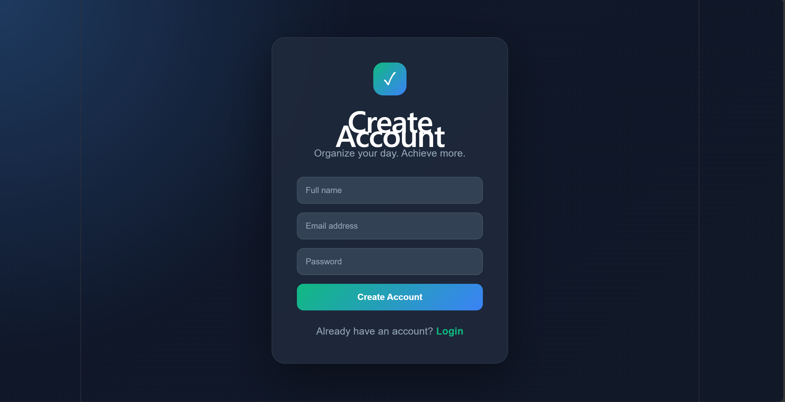
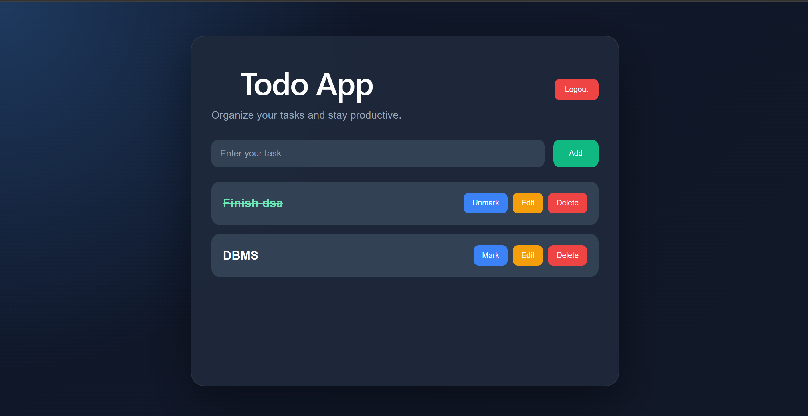

# 📝 MERN Todo App with JWT Authentication

A full-stack multi-user Todo List application built using the MERN stack.

The application allows users to register, log in securely, and manage their own personal tasks. JWT authentication is used to protect routes, while passwords are securely hashed before being stored in MongoDB Atlas.

Each logged-in user can only access and manage their own tasks.

---

## 🚀 Features

* User registration and login
* JWT-based authentication
* Secure password hashing using bcrypt
* Protected routes
* User-specific Todo dashboard
* Add new tasks
* Update existing tasks
* Delete tasks
* Mark tasks as completed
* Unmark completed tasks
* Secure user-specific CRUD operations
* Data storage using MongoDB Atlas
* Responsive and modern UI
* Logout functionality

---

## 📸 Screenshots

### Authentication



### Todo Dashboard



---

## 🛠️ Tech Stack

### Frontend

* React.js
* React Router DOM
* Axios
* CSS

### Backend

* Node.js
* Express.js
* JSON Web Token (JWT)
* bcryptjs

### Database

* MongoDB Atlas
* Mongoose

---

## 🔐 Authentication Flow

```text
User Registration
        ↓
Password Hashing using bcrypt
        ↓
User stored in MongoDB
        ↓
User Login
        ↓
Credentials Verification
        ↓
JWT Token Generated
        ↓
Token stored in Local Storage
        ↓
Protected Todo Dashboard
        ↓
Authenticated API Requests
```

JWT tokens are sent with protected API requests using the Authorization header:

```text
Authorization: Bearer <token>
```

---

## 📂 Project Structure

```text
maincraft-task2-task3-task4-todo-app
│
├── client
│   └── src
│       ├── pages
│       │   ├── Login.jsx
│       │   ├── Register.jsx
│       │   └── Todo.jsx
│       │
│       ├── ProtectedRoute.jsx
│       ├── App.jsx
│       ├── App.css
│       ├── index.css
│       └── main.jsx
│
├── server
│   ├── middleware
│   │   └── authMiddleware.js
│   │
│   ├── models
│   │   ├── Task.js
│   │   └── User.js
│   │
│   ├── .env
│   ├── package.json
│   └── server.js
│
├── screenshots
│   ├── todo_authentication.png
│   └── todo.png
│
├── .gitignore
└── README.md
```

---

## ⚙️ Installation

### Clone Repository

```bash
git clone https://github.com/JanviArora24/maincraft-task2-task3-task4-todo-app.git
```

Move into the project directory:

```bash
cd maincraft-task2-task3-task4-todo-app
```

---

## Backend Setup

Move into the server directory:

```bash
cd server
```

Install dependencies:

```bash
npm install
```

Create a `.env` file inside the `server` directory:

```env
MONGO_URI=your_mongodb_connection_string
JWT_SECRET=your_jwt_secret_key
```

Start the backend server:

```bash
npx nodemon server.js
```

The backend server runs on:

```text
http://localhost:5000
```

---

## Frontend Setup

Open another terminal and move into the client directory:

```bash
cd client
```

Install dependencies:

```bash
npm install
```

Start the frontend:

```bash
npm run dev
```

The frontend runs on:

```text
http://localhost:5173
```

---

## 🔗 API Endpoints

### Authentication

#### Register User

```http
POST /register
```

#### Login User

```http
POST /login
```

#### Get User Profile

```http
GET /profile
```

Protected route. Requires a valid JWT token.

---

### Todo Operations

#### Add Task

```http
POST /add
```

#### Get Logged-in User Tasks

```http
GET /tasks
```

#### Update Task

```http
PUT /update/:id
```

#### Delete Task

```http
DELETE /delete/:id
```

#### Toggle Complete / Incomplete

```http
PUT /toggle/:id
```

All Todo routes are protected using JWT authentication.

Users can only access and modify tasks associated with their own account.

---

## 🔒 Security Features

* Passwords are hashed using bcrypt before database storage.
* JWT tokens are used for authentication.
* Protected routes verify JWT tokens using authentication middleware.
* Todo operations are restricted to the authenticated user.
* Environment variables are stored in `.env`.
* `.env` is excluded from Git using `.gitignore`.

---

## 📌 Future Improvements

* Search tasks
* Filter completed and pending tasks
* Task priority levels
* Due dates
* Password reset functionality
* Email verification
* Token refresh mechanism

---

## 👩‍💻 Author

**Janvi Arora**

GitHub:  
https://github.com/JanviArora24

---

Built as part of the Maincrafts Technology MERN Stack Internship Tasks 2, 3, and 4.
